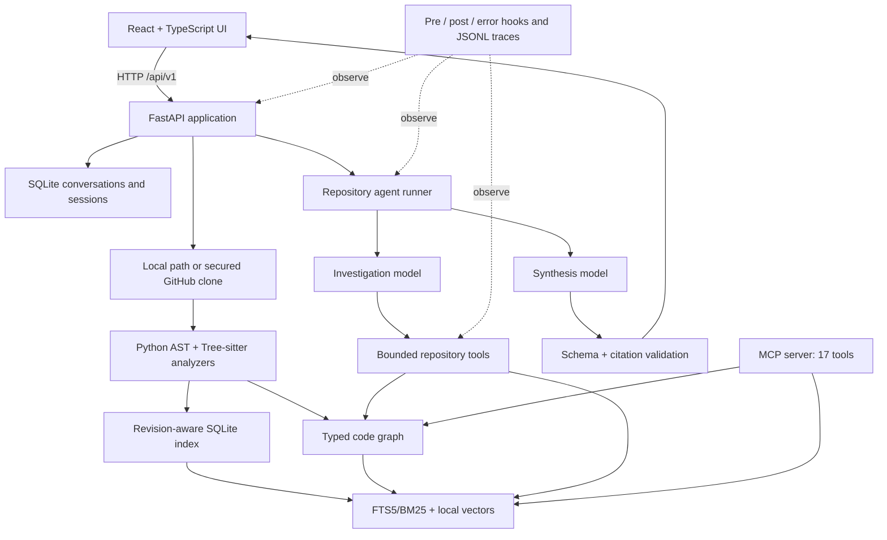

# Waypoint — Adaptive Codebase Onboarding

Waypoint turns Python, JavaScript, TypeScript/TSX, Java, HTML, and CSS repositories into an
evidence-aware code graph and a role-specific onboarding workspace. It uses
static analysis only: analyzed repository code is never imported or executed.

## Architecture



FastAPI and Pydantic provide typed HTTP boundaries and generated OpenAPI; React,
TypeScript, Tailwind CSS, React Flow, and Monaco provide the interactive evidence
workspace. SQLite keeps the project locally deployable while persisting graph sessions,
chunks, lexical/vector indexes, issues, and conversation memory. The model layer supports
OpenRouter, the Anthropic API, and the Claude Agent SDK. In dual mode a low-cost model can
investigate through tools while a stronger model synthesizes a validated answer.

The detailed verification package, including coverage, Flask HTTP E2E, live multi-step
agent evidence, and same-question two-model comparison, is in
[`verification/README.md`](verification/README.md). Significant AI-assisted engineering
interactions are recorded in [`prompts.md`](prompts.md).

## What is included

- Python AST extraction for modules, classes, functions, methods, imports, and calls
- Tree-sitter extraction for JavaScript/JSX, TypeScript/TSX, Java, HTML, and CSS
- ES module imports/re-exports, CommonJS `require`, Java packages/imports, lexical
  containment, and conservatively inferred calls
- Explicit class-instantiation edges plus locally constructed receiver resolution for
  cross-file Python, JavaScript/TypeScript, and Java method calls
- Exact source spans, confidence, and unresolved-reference diagnostics
- Scalable React Flow visualization with on-demand neighborhood expansion
- Read-only Monaco source viewer and evidence inspector
- Claude-powered repository Q&A with bounded retrieval tools and validated citations
- revision-aware SQLite code indexing with persisted chunks, symbols, edges, file
  hashes, FTS5/BM25 search, and automatic refresh when repository contents change
- local subword-vector retrieval, reciprocal-rank fusion, graph expansion, index
  status/rebuild controls, and restart-safe issue/onboarding state
- pre/post/error function hooks, correlated model/tool/retrieval traces, rotating JSONL
  diagnostics, and a 17-tool MCP connector over stdio or Streamable HTTP
- readable GitHub-flavored Markdown rendering for model answers in Ask and Onboarding
- Bounded code journeys through calls, imports, and containment
- Backend, security, QA, and general onboarding routes
- Deterministic comprehension checks and mastery scores
- Model-proposed first contributions with deterministic file/blast-radius validation
- GitHub issue history plus separately labeled static and AI issue proposals
- Change-aware refreshers between analyses of the same repository
- Persistent light and dark themes
- Structured request, function, parser, graph, and subprocess diagnostics

### Language coverage

The structural graph recognizes `.py`, `.js`, `.jsx`, `.mjs`, `.cjs`, `.ts`,
`.tsx`, `.mts`, `.cts`, `.java`, `.html`, `.htm`, and `.css`. Python uses the standard AST; the other
languages use their official Tree-sitter grammars. File cards display the
detected language.

HTML IDs/classes and CSS selectors are source-backed symbols. Local HTML stylesheet/script
references and CSS `@import` statements become verified file edges; remote web assets remain
explicit external references. Browser-generated DOM relationships, CSS preprocessors, and
bundler-specific aliases are outside the current static-analysis boundary.

Containment and resolved internal imports are marked verified. Static call edges
are inferred only when Waypoint can identify a unique lexical symbol, imported
symbol/namespace, CommonJS alias, or Java receiver with a declared type. Dynamic
dispatch, dependency injection, reflection, generated source, package-manager
exports, and TypeScript `paths` aliases are not guessed; they remain unresolved
until dedicated compiler/project configuration or runtime evidence is added.

### Explore layout controls

- Use the arrow buttons in the **Repository** and **Inspector** headings to
  collapse or restore either sidebar independently.
- Drag the horizontal handle immediately above the source viewer to resize it.
  Arrow Up/Down adjust the focused handle; double-click restores its default.
- Use **Fullscreen** in the graph toolbar for a viewport-sized graph. Press
  Escape or **Exit fullscreen** to return to the adjustable Explore layout.
- Select any file-card class, function, or method and use the Inspector's **Usage**
  tab for incoming/outgoing source-backed relationships, or **Ask AI** for a
  symbol-scoped explanation seeded with those exact call sites.

### Ask workspace

Ask uses a split workspace: conversation remains on the left, while only files
cited in the final response appear on the right. Claude can list the repository,
search indexed source, read bounded source ranges, inspect symbols, and expand
graph neighborhoods. The backend verifies every final citation against evidence
the model actually inspected before showing it in Monaco.

For common architectural questions Claude also has deterministic high-level
tools for repository overview, feature evidence, entry-point discovery, backend
layer classification, file structure, symbol relationships, related tests,
dependency impact, project configuration, and analysis diagnostics. Independent
tool calls in one round execute concurrently. The final rounds force structured
answer submission and retain validation retries instead of allowing indefinite
repository browsing. The Answer Evidence panel includes an agent-activity trace
with tool names, rounds, duration, and evidence-file counts.

Repository-overview questions such as “What is this repository about? Highlight
its top 10 features” are grounded first in the repository README, then
corroborated with manifests and central production modules. Test symbols are not
used as product evidence unless the question explicitly asks about tests.

At backend startup, Waypoint sends one minimal prompt through
`ANTHROPIC_API_KEY`. A successful API probe keeps the configured
`WAYPOINT_MODEL` as the primary provider. If the API cannot accept the prompt,
Waypoint verifies the locally authenticated Claude Code subscription through
the official Agent SDK and activates it as the fallback. Runtime API billing,
capacity, and rate-limit failures also switch subsequent calls to Claude Code.
Set `WAYPOINT_CLAUDE_CODE_FALLBACK=0` to disable this behavior. The fallback
removes `ANTHROPIC_API_KEY` from the Claude Code subprocess and disables its
native filesystem, shell, web, project-setting, and skill tools.

Agent tools are not loaded from a `SKILL.md`. Their names, descriptions, and
JSON input schemas live in `backend/app/agent/service.py`; `_execute_tool`
dispatches validated calls to the immutable retrieval index and semantic graph
services. Ask uses the full registry, while onboarding and issue investigation
derive restricted registries and add their own structured submission tool. The
separate MCP server exposes selected Waypoint services to external clients, but
it is not how the internal repository agent receives its tools.

Conversation memory is owned by the backend and retains the configured number
of recent turns per analysis.

Onboarding uses the same repository agent. It creates a role-, objective-,
experience-, and time-specific ordered file tour; opens the selected source
ranges inside the workspace; supports contextual questions; evaluates free-text
comprehension against hidden evidence rubrics; and validates contribution
proposals independently of the model.

The Issues workspace synchronizes real open/closed GitHub issues and per-issue
timeline history. Static graph findings and model investigations remain in a
separate proposal stream and are never presented as maintainer-confirmed issues.

The validated external-repository matrix is in
[`benchmarks/results/README.md`](benchmarks/results/README.md).

## Install

Requires Python 3.12+ and Node.js 20+.

```powershell
python -m venv .venv
.\.venv\Scripts\python.exe -m pip install -e ".[dev]"

cd frontend
npm.cmd install
npm.cmd run build
cd ..
```

## Run

Create `.env` from the safe template. Add an Anthropic API key, authenticate
Claude Code with `claude login`, or configure both for automatic fallback:

```powershell
Copy-Item .env.example .env
# Edit .env; never expose ANTHROPIC_API_KEY through a VITE_ variable.
```

```powershell
.\.venv\Scripts\python.exe -m uvicorn backend.app.main:app --reload
```

Open `http://127.0.0.1:8000`. FastAPI serves both the API and compiled frontend.
The repository field accepts an absolute path inside `ONBOARD_ALLOWED_ROOT`, or
a path relative to that root.

```powershell
Invoke-RestMethod `
  -Method Post `
  -Uri http://127.0.0.1:8000/api/v1/analysis `
  -ContentType application/json `
  -Body '{"repository_path":"."}'
```

To permit repositories beneath another workspace:

```powershell
$env:ONBOARD_ALLOWED_ROOT="C:\path\to\workspace"
```

### Import from GitHub

In the top-bar **Source** selector, choose **GitHub repository**, paste a public
URL such as `https://github.com/pallets/flask`, and click **Analyze**. Waypoint
performs a shallow, non-interactive clone and immediately analyzes it.

Clones are kept under `.waypoint-clones` inside `ONBOARD_ALLOWED_ROOT` so source
navigation remains available for the analysis session. Override the location
with `ONBOARD_CLONE_ROOT`; the configured directory must remain inside the
allowed root.

```powershell
$env:ONBOARD_CLONE_ROOT="C:\path\to\workspace\.waypoint-clones"
$env:ONBOARD_CLONE_TIMEOUT_SECONDS="180"
$env:ONBOARD_MAX_CLONE_BYTES="1000000000"
$env:ONBOARD_MAX_CLONE_FILES="100000"
$env:ONBOARD_MAX_RETAINED_CLONES="10"
```

Only public HTTPS `github.com/owner/repository` URLs are accepted. Credentialed
URLs, SSH and local-file transports, custom ports, query strings, fragments,
and repository subpaths are rejected. Cloning does not execute repository code.
Checkout file/byte limits are enforced, and symbolic source files are not
analyzed. Old application-managed clones are pruned to the configured retention
limit, and clone storage is excluded when analyzing its parent workspace.

## Diagnostic terminal modes

Waypoint logs operation start/completion, durations, request correlation IDs,
process/thread identity, parser decisions, graph activity, failures, and safe
summaries of arguments and results.

```powershell
# Lifecycle plus detailed parser and graph events
$env:ONBOARD_LOG_LEVEL="DEBUG"

# Decorated function arguments, returns, durations, and exceptions
$env:ONBOARD_TRACE_FUNCTIONS="1"

# Every Python call under backend/app (extremely noisy)
$env:ONBOARD_MAX_TRACE="1"

# Increase rendered diagnostic value length
$env:ONBOARD_LOG_VALUE_LIMIT="4000"

# Retain more unresolved call details; the true count is always preserved
$env:ONBOARD_MAX_UNRESOLVED_CALL_DETAILS="50000"
```

Secrets, cookies, authorization values, and secret-like fields are redacted.
Source contents are not dumped into logs. The shell-free subprocess wrapper in
`backend/app/processes.py` streams stdout and stderr line-by-line and logs PID,
command, working directory, timeout, exit status, and duration.

## Verify

```powershell
.\.venv\Scripts\python.exe -m pytest

cd frontend
npm.cmd run build
npm.cmd run test:e2e
```

The browser suite expects the production app at `http://127.0.0.1:8766`.

```powershell
.\.venv\Scripts\python.exe -m uvicorn backend.app.main:app `
  --host 127.0.0.1 --port 8766
```

## Security boundary

Waypoint deliberately does not execute arbitrary repository tests or runtime
traces. Those require a separate hardened sandbox with network isolation,
resource limits, and a dedicated threat model. Static inferred calls are never
presented as observed runtime facts.
